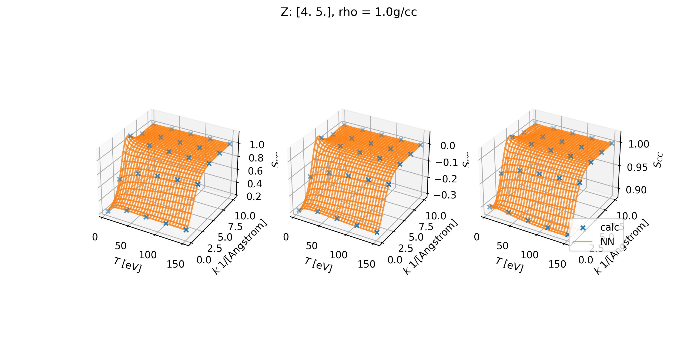

# Trained Neural Networks for Ion-Ion SSFs

This repo contains trained neural networks to interpolate the ionic static
structure factors with [jaxrts](https://github.com/jaxrts/jaxrts).

Scripts for generating the datasets from HNC calculations, for performing the
training itself and for some sanity checks are given in the
[tools directory of jaxrts](https://github.com/JaXRTS/jaxrts/tree/main/tools/SiiInterpolation).

  <picture>
      
  </picture>

## Directory structure
- `train_data` contains datasets of HNC calculations for the given Plasma
  constituents. The data itself is in a `.h5` file. Next to this, the
  `PlasmaState` is saved to a `.json` file with the same name, and information
  about the sampling range and used `jaxrts` version is stored in a `.info`
  file. As ionization, density and temperature are varied, these saved
  `PlasmaState` is only used to store the models used for generating the data
  -- and not the state parameters itself.
- `trained_NNs` contain trained networks, which can be used with the
  `jaxrts.experimental.SiiNN.NNSiiModel` `"ionic scattering"` Model, by passing
  the path to the downloaded checkpoint directory.
  The directory should also contain the results of some sanity checks as saved
  image data.

